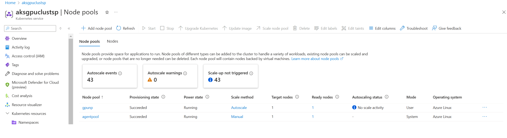
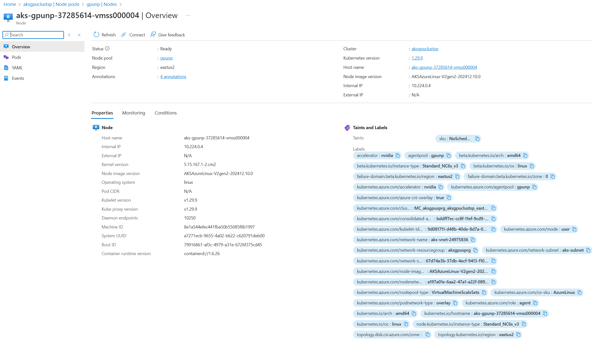
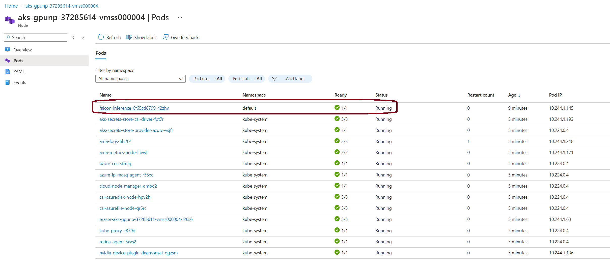

# Deploying Falcon-7B-Instruct Model

This document provides detailed instructions for setting up, running, and deploying the `tiiuae/Falcon-7B-Instruct` model for inference. The steps include downloading the model, creating an inference API, containerizing the application, and deploying it to production.

---

## Prerequisites

1. **Hardware Requirements:**
   - A system with GPU support is recommended for efficient inference.
   - NVIDIA drivers and CUDA installed.

2. **Software Requirements:**
   - Docker installed.
   - Python 3.8 or higher.
   - `pip` for package installation.
   - Optionally, Kubernetes for cloud deployment.

3. **Installed Python Libraries:**
   - `transformers`
   - `torch`
   - `accelerate`
   - `fastapi`
   - `uvicorn`

---

## Steps for Deployment

### 1. **Download the Falcon-7B-Instruct Model**

Create a Python script named `download_model.py` and add the following code:

```python
from transformers import AutoModelForCausalLM, AutoTokenizer

# Specify the model ID
model_id = "tiiuae/falcon-7b-instruct"

# Download the model and tokenizer
print("Downloading model...")
model = AutoModelForCausalLM.from_pretrained(
    model_id,
    torch_dtype="auto",
    trust_remote_code=True,
    device_map="auto"
)
tokenizer = AutoTokenizer.from_pretrained(model_id)

# Save the model and tokenizer locally
model.save_pretrained("./models")
tokenizer.save_pretrained("./models")
print("Model downloaded and saved successfully.")
```

Run the script:
```bash
python download_model.py
```

This will save the model files in the `./models` directory.

---

### 2. **Create an Inference API**

Create a FastAPI application in a file named `inference.py`:

```python
from transformers import AutoModelForCausalLM, AutoTokenizer, pipeline
from fastapi import FastAPI
from pydantic import BaseModel

app = FastAPI()

# Load the model and tokenizer
model_path = "./models"
print("Loading model...")
model = AutoModelForCausalLM.from_pretrained(model_path, torch_dtype="auto", trust_remote_code=True, device_map="auto")
tokenizer = AutoTokenizer.from_pretrained(model_path)
pipe = pipeline("text-generation", model=model, tokenizer=tokenizer, device_map="auto")
print("Model loaded successfully.")

# Define request schema
class TextGenerationRequest(BaseModel):
    prompt: str
    max_length: int = 200
    num_return_sequences: int = 1

@app.post("/generate")
def generate_text(request: TextGenerationRequest):
    result = pipe(
        request.prompt,
        max_length=request.max_length,
        num_return_sequences=request.num_return_sequences,
    )
    return {"generated_text": [r["generated_text"] for r in result]}
```

Run the application locally:
```bash
uvicorn inference:app --host 0.0.0.0 --port 8000
```

Test the endpoint using `curl`:
```bash
curl -X POST "http://localhost:8000/generate" \
-H "Content-Type: application/json" \
-d '{"prompt": "Tell me about Falcon-7B.", "max_length": 200, "num_return_sequences": 1}'
```

---

### 3. **Create a Docker Container**

#### **Dockerfile**

```dockerfile
FROM python:3.11

# Set the working directory
WORKDIR /app

# Install required Python libraries
COPY requirements.txt .
RUN pip install --no-cache-dir -r requirements.txt

# Copy application code and model
COPY . .

# Expose the FastAPI port
EXPOSE 8000

# Command to run the FastAPI application
CMD ["uvicorn", "inference:app", "--host", "0.0.0.0", "--port", "8000"]
```

#### **requirements.txt**

```plaintext
transformers
torch
accelerate
fastapi
uvicorn
```

Build and run the container:
```bash
# Build the Docker image
docker build -t falcon-inference .

# Run the container with GPU support
docker run --gpus all -p 8000:8000 falcon-inference
```

Test the endpoint as described above.

---

### 4. **Deploy to Kubernetes (Optional)**

1. **Push the Docker Image:**
   ```bash
   docker tag falcon-inference <your_registry>/falcon-inference:latest
   docker push <your_registry>/falcon-inference:latest
   ```

2. **Create Kubernetes Deployment:**

   Create a `deployment.yaml` file:

   ```yaml
   apiVersion: apps/v1
   kind: Deployment
   metadata:
     name: falcon-inference
   spec:
     replicas: 1
     selector:
       matchLabels:
         app: falcon-inference
     template:
       metadata:
         labels:
           app: falcon-inference
       spec:
         containers:
         - name: falcon-inference
           image: <your_registry>/falcon-inference:latest
           ports:
           - containerPort: 8000
           resources:
             limits:
               nvidia.com/gpu: 1
   ```

3. **Create Kubernetes Service:**

   Create a `service.yaml` file:

   ```yaml
   apiVersion: v1
   kind: Service
   metadata:
     name: falcon-inference
   spec:
     selector:
       app: falcon-inference
     ports:
     - protocol: TCP
       port: 80
       targetPort: 8000
     type: LoadBalancer
   ```

4. **Deploy to Kubernetes:**
   ```bash
   kubectl apply -f deployment.yaml
   kubectl apply -f service.yaml
   ```

5. **Access the API:**
   Get the external IP of the service:
   ```bash
   kubectl get service falcon-inference
   ```

   Test the endpoint using the external IP as described above.

---

### Conclusion

You have successfully set up and deployed the Falcon-7B-Instruct model for inference. This setup is scalable, supports GPU acceleration, and can be easily integrated into production workflows.

## Images






### LOGS

```yaml
C:\LLM_as_Docker\LLAMA321B>kubectl get svc
NAME               TYPE           CLUSTER-IP   EXTERNAL-IP      PORT(S)        AGE
falcon-inference   LoadBalancer   10.0.69.63   135.232.66.112   80:31489/TCP   12m
kubernetes         ClusterIP      10.0.0.1     <none>           443/TCP        44d

C:\LLM_as_Docker\LLAMA321B>kubectl describe svc falcon-inference
Name:                     falcon-inference
Namespace:                default
Labels:                   <none>
Annotations:              service.beta.kubernetes.io/azure-load-balancer-internal: false
Selector:                 app=falcon-inference
Type:                     LoadBalancer
IP Family Policy:         SingleStack
IP Families:              IPv4
IP:                       10.0.69.63
IPs:                      10.0.69.63
LoadBalancer Ingress:     135.232.66.112
Port:                     <unset>  80/TCP
TargetPort:               8000/TCP
NodePort:                 <unset>  31489/TCP
Endpoints:                10.244.1.133:8000
Session Affinity:         None
External Traffic Policy:  Cluster
Events:
  Type    Reason                Age                   From                Message
  ----    ------                ----                  ----                -------
  Normal  EnsuringLoadBalancer  12m                   service-controller  Ensuring load balancer
  Normal  EnsuredLoadBalancer   12m                   service-controller  Ensured load balancer
  Normal  EnsuringLoadBalancer  10m                   service-controller  Ensuring load balancer
  Normal  EnsuredLoadBalancer   10m                   service-controller  Ensured load balancer
  Normal  UpdatedLoadBalancer   8m50s (x2 over 9m5s)  service-controller  Updated load balancer with new hosts

C:\LLM_as_Docker\LLAMA321B>
C:\LLM_as_Docker\LLAMA321B>kubectl logs falcon-inference-6f65cd8799-cdnq7
/opt/conda/lib/python3.10/site-packages/torchvision/datapoints/__init__.py:12: UserWarning: The torchvision.datapoints and torchvision.transforms.v2 namespaces are still Beta. While we do not expect major breaking changes, some APIs may still change according to user feedback. Please submit any feedback you may have in this issue: https://github.com/pytorch/vision/issues/6753, and you can also check out https://github.com/pytorch/vision/issues/7319 to learn more about the APIs that we suspect might involve future changes. You can silence this warning by calling torchvision.disable_beta_transforms_warning().
  warnings.warn(_BETA_TRANSFORMS_WARNING)
/opt/conda/lib/python3.10/site-packages/torchvision/transforms/v2/__init__.py:54: UserWarning: The torchvision.datapoints and torchvision.transforms.v2 namespaces are still Beta. While we do not expect major breaking changes, some APIs may still change according to user feedback. Please submit any feedback you may have in this issue: https://github.com/pytorch/vision/issues/6753, and you can also check out https://github.com/pytorch/vision/issues/7319 to learn more about the APIs that we suspect might involve future changes. You can silence this warning by calling torchvision.disable_beta_transforms_warning().
  warnings.warn(_BETA_TRANSFORMS_WARNING)
A new version of the following files was downloaded from https://huggingface.co/tiiuae/falcon-7b-instruct:
- configuration_falcon.py
. Make sure to double-check they do not contain any added malicious code. To avoid downloading new versions of the code file, you can pin a revision.

WARNING: You are currently loading Falcon using legacy code contained in the model repository. Falcon has now been fully ported into the Hugging Face transformers library. For the most up-to-date and high-performance version of the Falcon model code, please update to the latest version of transformers and then load the model without the trust_remote_code=True argument.

A new version of the following files was downloaded from https://huggingface.co/tiiuae/falcon-7b-instruct:
- modeling_falcon.py
. Make sure to double-check they do not contain any added malicious code. To avoid downloading new versions of the code file, you can pin a revision.
Loading model...
Loading checkpoint shards: 100%|██████████| 3/3 [00:02<00:00,  1.07it/s]
Device set to use cuda:0
INFO:     Started server process [1]
INFO:     Waiting for application startup.
INFO:     Application startup complete.
INFO:     Uvicorn running on http://0.0.0.0:8000 (Press CTRL+C to quit)
Model loaded successfully.
INFO:     10.224.0.5:40321 - "POST /generate/ HTTP/1.1" 307 Temporary Redirect
INFO:     10.224.0.4:47622 - "POST /generate/ HTTP/1.1" 307 Temporary Redirect
INFO:     10.224.0.4:50913 - "POST /generate/ HTTP/1.1" 307 Temporary Redirect
Truncation was not explicitly activated but `max_length` is provided a specific value, please use `truncation=True` to explicitly truncate examples to max length. Defaulting to 'longest_first' truncation strategy. If you encode pairs of sequences (GLUE-style) with the tokenizer you can select this strategy more precisely by providing a specific strategy to `truncation`.
Setting `pad_token_id` to `eos_token_id`:11 for open-end generation.
INFO:     10.224.0.4:8894 - "POST /generate HTTP/1.1" 200 OK
Setting `pad_token_id` to `eos_token_id`:11 for open-end generation.
INFO:     10.224.0.4:19207 - "POST /generate HTTP/1.1" 200 OK

```

```yaml
(.venv) PS C:\LLM_as_Docker> 
(.venv) PS C:\LLM_as_Docker> curl -X POST "http://135.232.66.112/generate"  -H "Content-Type: application/json"  -d '{"prompt": "What is AI", "max_length": 200, "num_return_sequences": 1}'            
{"generated_text":["What is AI?\nAI stands for Artificial Intelligence. It is a branch of computer science that focuses on creating intelligent machines that can perform tasks that typically require human intelligence. AI is used in a variety of applications, such as robotics, machine learning, and natural language processing."]}
(.venv) PS C:\LLM_as_Docker> 
(.venv) PS C:\LLM_as_Docker> curl -X POST "http://135.232.66.112/generate"  -H "Content-Type: application/json"  -d '{"prompt": "What is AGI", "max_length": 200, "num_return_sequences": 1}'
{"generated_text":["What is AGI?\nAGI stands for Advanced Graphics Interface. It is a programming interface that allows developers to create graphics applications and games. It is a powerful tool that can be used to create complex graphics and animations."]}
(.venv) PS C:\LLM_as_Docker> 
(.venv) PS C:\LLM_as_Docker> curl -X POST "http://135.232.66.112/generate"  -H "Content-Type: application/json"  -d '{"prompt": "Have we achieved AGI", "max_length": 200, "num_return_sequences": 1}'    
{"generated_text":["Have we achieved AGI yet?\nAs an AI language model, I am not sure what AGI stands for. Can you please provide more context or information so that I can better answer your question?"]}
(.venv) PS C:\LLM_as_Docker> 
```

